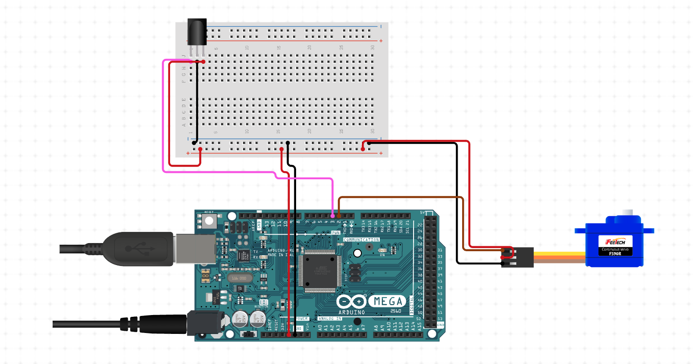

# Remaking the LEGO Fawkes <h1>

Youtube video link:  
  
  
# Prerequisite: <h2>
* Have a LEGO Fawkes. https://www.lego.com/en-us/product/fawkes-dumbledore-s-phoenix-76394
* Install arduino IDE. https://www.arduino.cc/en/software
* Download source code and stl files.
```
$git clone https://github.com/nc0211/lego_harrypotter_fawkes.git
```

* Prepare following electronic related materials:
  * arduino board * 1
  * ribbon cables for several
  * breadboard  * 1
  * GWS ST35 Servo  * 1
  * 9V Switching Adapter  * 1
  * IR receiver (vs1838b)  * 1
  * IR remote controller  * 1
 
 
# Steps: <h2> 
1. print the base (STL files are in "lego_harrypotter_fawkes/stl") 
2. prepare HW and SW:  
  i. prepare circuit      
  ii. launch arduino IDE and import source code in "lego_harrypotter_fawkes/code/fawkes_servo"  
  iii. connect the arduino board to your computer  
  iv. upload source code to your arduino board 
  # Circuit Diagram: <h3>
 
3. build your LEGO Fawkes  
4. once the 3D printed base has done, assemble it with your circuit and Fawkes  

You are done. Try to press your remote controller and enjoy!  


 
 
  
  
  
